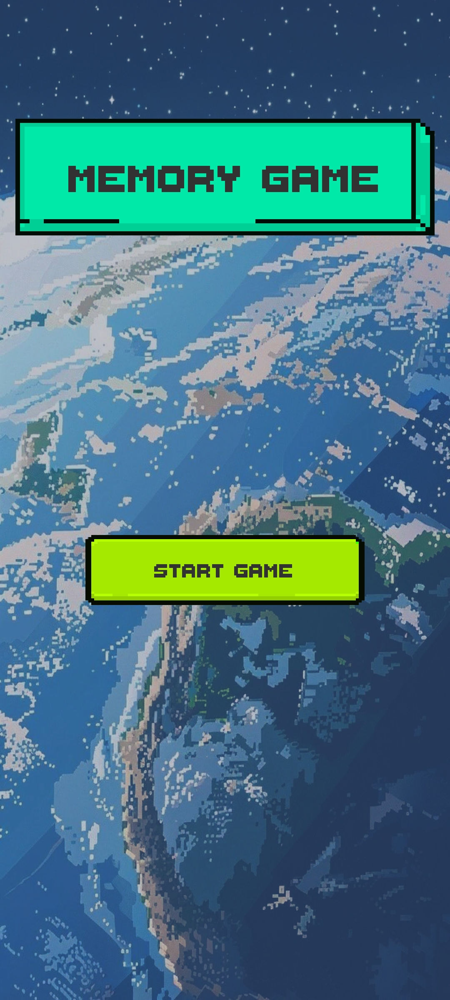
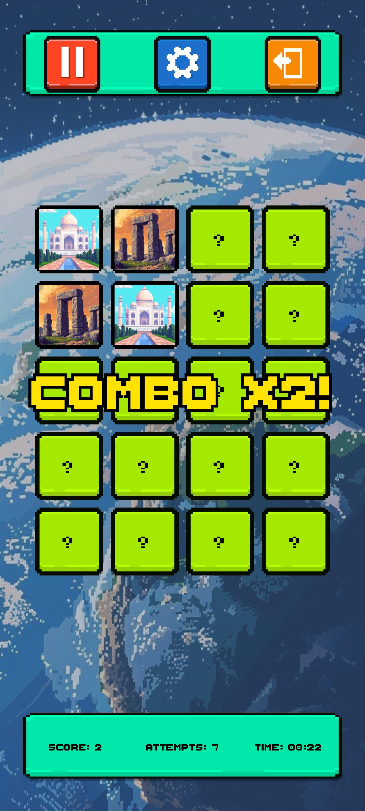
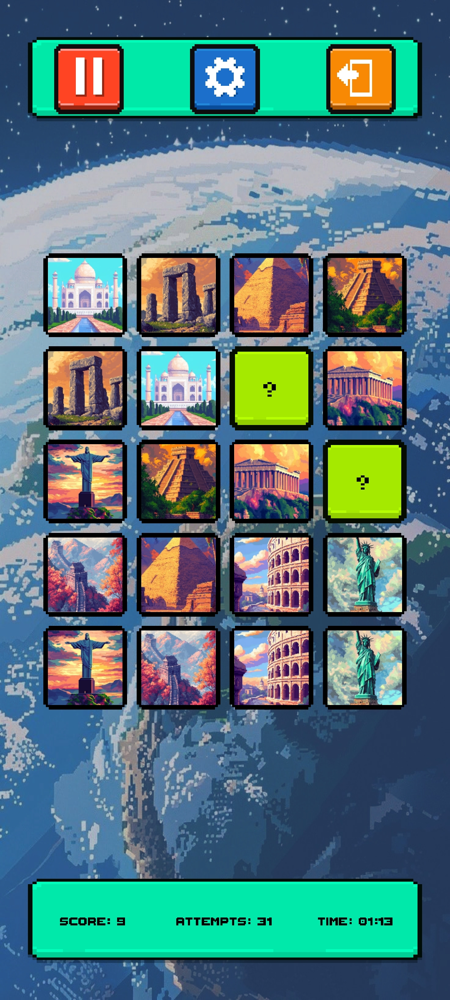
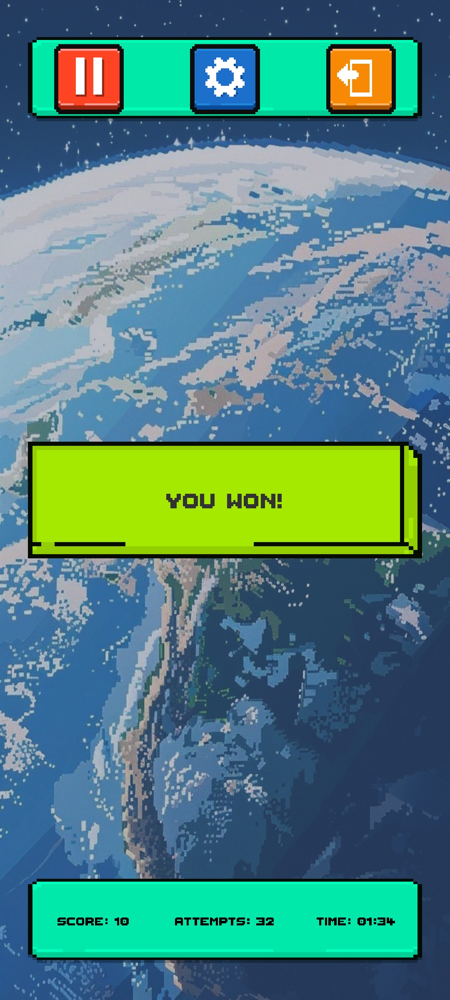

# Game of Memory

<div style="display: grid; grid-template-columns: repeat(auto-fit, minmax(160px, 1fr)); gap: 12px; margin: 16px 0;">
  
  
  
  
</div>

Game of Memory is a mobile-friendly Unity implementation of the classic memory card game. The player reveals two cards per turn, tries to find matching pairs, and wins when all pairs are found.

The project uses a small Node.js server to provide a randomized card configuration. Card data is stored in JSON on the server, while card images are loaded by the Unity client from remote URLs such as Cloudinary.

## Features

- Classic two-card memory matching gameplay
- Randomized card order from a Node.js server
- 10-pair game setup
- Score, attempts, elapsed timer, and combo popup
- Pause, restart, exit, and game-complete states
- Preloaded remote card images
- Background music and card sound effects
- Portrait mobile UI layout

## Server

The server exposes a simple API for creating new games.

```text
GET /api/games/new
GET /api/games/new?pairs=10
GET /api/games/health
```

Run locally:

```bash
cd Server
npm install
npm start
```

## Unity Client

Open the Unity project from:

```text
MemoryGame/
```

Required scene order:

```text
0 MainMenuScene
1 GameScene
```

The client API URL is configured through the `ApiSettings` asset:

```text
Create -> Memory Game -> Configuration -> API Settings
```

For Render deployment, use the root server URL only:

```text
https://your-app-name.onrender.com
```

Do not include `/api/games`; the client appends the endpoint path.

## Android Build

Install these Unity modules through Unity Hub:

```text
Android Build Support
Android SDK & NDK Tools
OpenJDK
```

Recommended player settings:

```text
Orientation: Portrait
Internet Access: Require
```

The Android build needs internet access because the game fetches the game configuration and remote card images.
